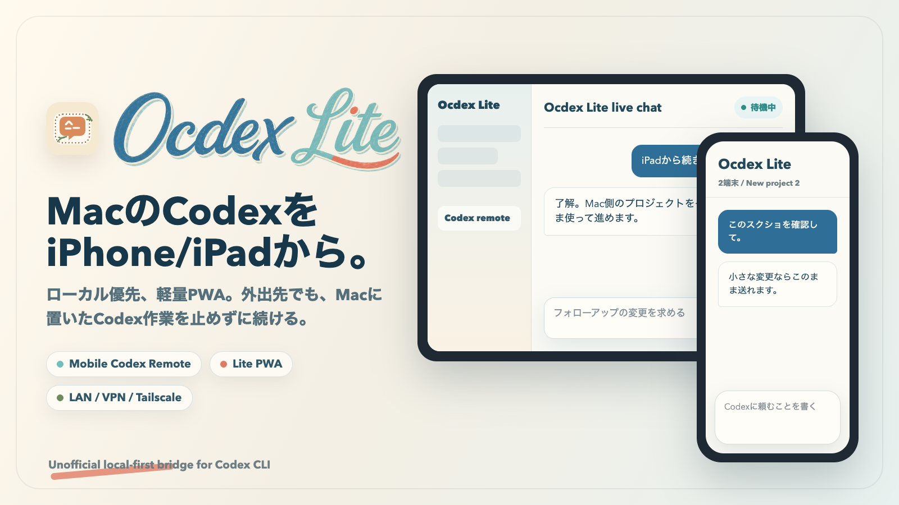
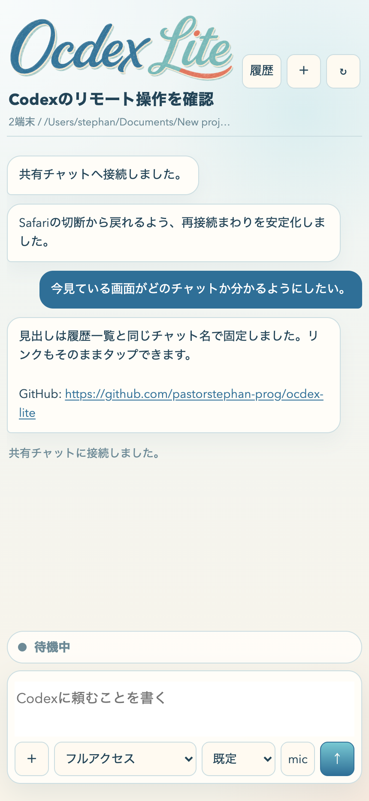
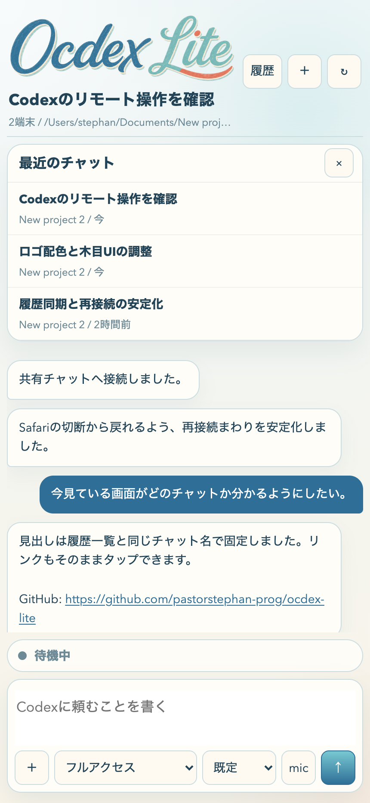
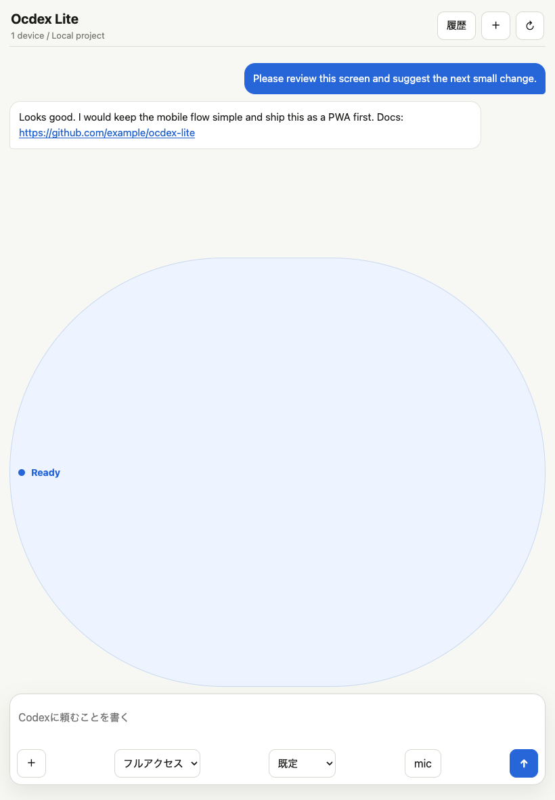

# Ocdex Lite



Use your iPhone or iPad as a lightweight remote for Codex running on your Mac.

Ocdex Lite is a local-first PWA for people who want Codex to keep working on a desktop machine, while they steer it from a phone or tablet. It keeps the Codex app-server on `127.0.0.1`, exposes a small token-protected bridge on your LAN, and serves a mobile-first chat UI at `/lite.html`.

> Status: early public MVP. Not affiliated with OpenAI.

## New Here?

If you are comfortable with Git, Node.js, and the Codex CLI, the free README below is enough to try Ocdex Lite.

If you want a slower, beginner-friendly Japanese walkthrough, use the paid setup guide:

**[iPhone/iPadからMacのCodex CLIを軽く操作する: Ocdex Liteやさしい自力セットアップガイド](https://note.com/ocdex_lite/n/nd69e05ae6f3c)**

Price: 500 JPY. It covers self-setup, iPhone/iPad access, launch-at-login setup, Tailscale notes, and common troubleshooting. Individual support is not included.

## Why This Exists

Codex is powerful on a Mac, but mobile remote control is still awkward. Heavy desktop-style UIs can disconnect, overflow, or fail on image payloads in mobile Safari. Ocdex Lite focuses on the smallest useful loop:

- ask Codex from iPhone/iPad
- continue a previous thread
- attach screenshots without giant WebSocket payloads
- tap links in replies
- reconnect cleanly after mobile Safari drops a socket
- keep the dangerous app-server boundary local

## Features

- **Lite PWA**: installable from Safari with "Add to Home Screen"
- **Local-first bridge**: phone browser -> LAN bridge -> localhost Codex app-server
- **Thread picker**: load recent chats only when you tap History
- **Continue old chats**: pick a thread and keep sending into it
- **HTTP image upload**: images are compressed and uploaded before the prompt, then passed to Codex as local files
- **Clickable links**: raw `https://...` URLs and Markdown links are tappable
- **Mobile reconnect guard**: avoids reconnect loops from intentional socket replacement
- **Safety defaults**: token URL, localhost app-server, LAN/VPN/Tailscale-oriented access

## Screenshots

<p>
  
  
  
</p>

## Quick Start

```bash
git clone https://github.com/pastorstephan-prog/ocdex-lite.git
cd ocdex-lite
git checkout v1.0.7
npm ci
npm run phone
```

Open the printed URL from an iPhone or iPad on the same network:

```text
http://YOUR-MAC.local:45214/lite.html?token=...
```

The full desktop-style UI remains available at:

```text
http://YOUR-MAC.local:45214/?token=...
```

## Recommended Mobile Flow

1. Start the bridge on the Mac.
2. Open `/lite.html?token=...` from iPhone or iPad.
3. Add it to the Home Screen.
4. Use **History** only when you need an older thread.
5. Use Tailscale, SSH forwarding, or a private VPN for access outside your LAN.

## Environment Variables

```bash
PHONE_UI_PORT=45214 npm run phone
PHONE_TOKEN=choose-your-own-token npm run phone
CODEX_WORKDIR=/path/to/project npm run phone
CODEX_MODEL=gpt-5.4 npm run phone
CODEX_HISTORY_SYNC=0 npm run phone # optional: disable Codex Desktop history warming
CODEX_THREAD_LIST_LIMIT=8 npm run phone
CODEX_HISTORY_LIMIT=30 npm run phone
CODEX_WS_MAX_PAYLOAD_MB=64 npm run phone
CODEX_UPLOAD_MAX_MB=12 npm run phone
```

## Utility Scripts

```bash
npm run token:reset
npm run launchagent:install -- --workdir "/path/to/project"
npm run simulator:smoke
```

`token:reset` rotates `.phone-token`. Existing phone URLs stop working after rotation.

`launchagent:install` creates a macOS LaunchAgent that starts Ocdex Lite at login and restarts it if it crashes.

`simulator:smoke` opens `/lite.html` in available Xcode iPhone/iPad simulators, saves screenshots, and prints bridge readiness. It is useful for quick release checks, but it does not replace real-device Wi-Fi, Tailscale, or lock-screen testing.

## Architecture

```text
iPhone/iPad Safari
  -> http://Mac-LAN-IP:45214/lite.html?token=...
  -> Node bridge
  -> ws://127.0.0.1:45213
  -> Codex app-server
```

The Codex app-server should stay bound to localhost. Do not expose it directly to a LAN or public internet.

## Security

- Treat `?token=...` URLs like local access keys.
- Do not post tokenized URLs in screenshots, issues, chats, or streams.
- Do not expose the bridge through an unauthenticated public tunnel or raw port forward.
- Prefer LAN, Tailscale, SSH forwarding, or a private VPN.
- Rotate `.phone-token` after demos or shared-network testing.

See [SECURITY.md](SECURITY.md).

## Need the Japanese Setup Guide?

This repository intentionally keeps the core app free and public. The paid note is for people who want the setup path explained gently in Japanese, with screenshots and beginner-facing checks.

- Paid guide: [Ocdex Liteやさしい自力セットアップガイド](https://note.com/ocdex_lite/n/nd69e05ae6f3c)
- Price: 500 JPY
- Best for: people who already have a Mac and Codex CLI, but are not comfortable reading only a GitHub README
- Not included: individual support, setup代行, environment-specific troubleshooting guarantees

## Commercial Goal

The first commercial goal is not an App Store app and not a GitHub Marketplace app. The goal is:

- public PWA repository
- [Paid self-setup guide](https://note.com/ocdex_lite/n/nd69e05ae6f3c), with no individual support promise
- a 500 JPY low-friction paid guide for people who want a stable mobile Codex remote

See [docs/ocdex-lite-goal.ja.md](docs/ocdex-lite-goal.ja.md) and [docs/ocdex-lite-commercial-plan.ja.md](docs/ocdex-lite-commercial-plan.ja.md).

## Attribution

Ocdex Lite is based on Codex Remote Control Lab by Sunwood AI Labs.

Original project:

- https://github.com/Sunwood-ai-labs/codex-remote-control-lab

The upstream project is licensed under ISC. Keep the original copyright notice and license text when redistributing.

## License

ISC. See [LICENSE](LICENSE).
